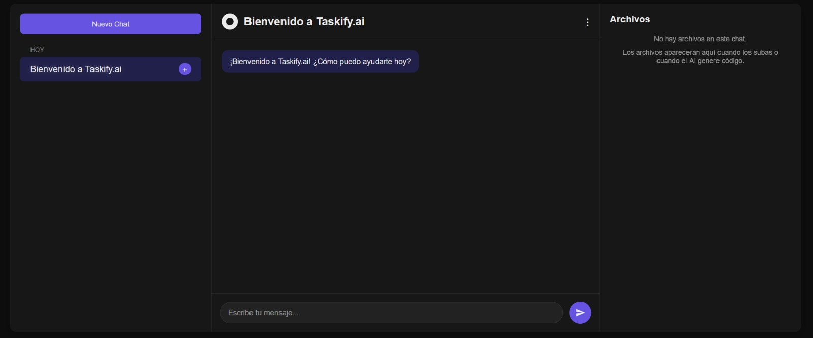
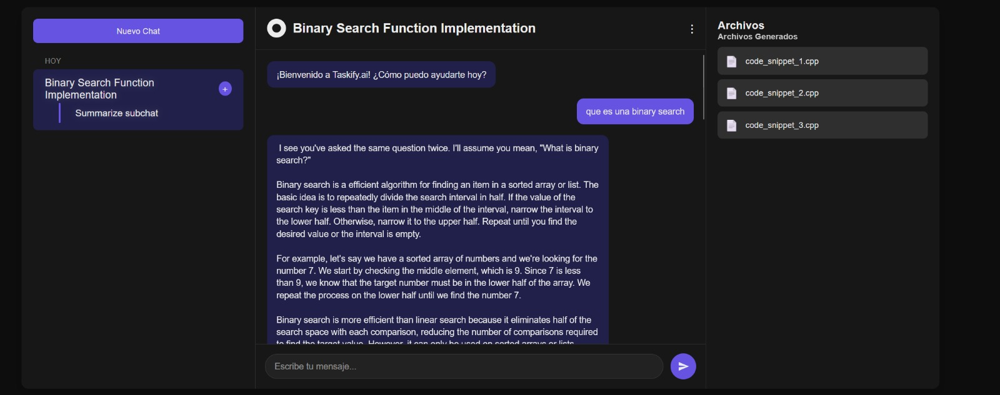
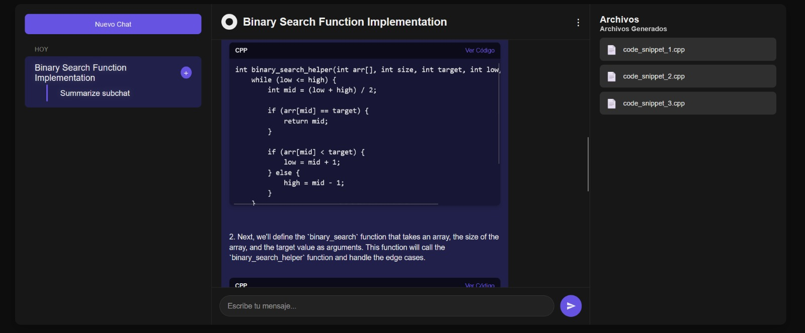
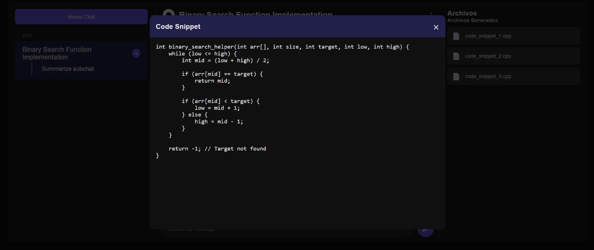
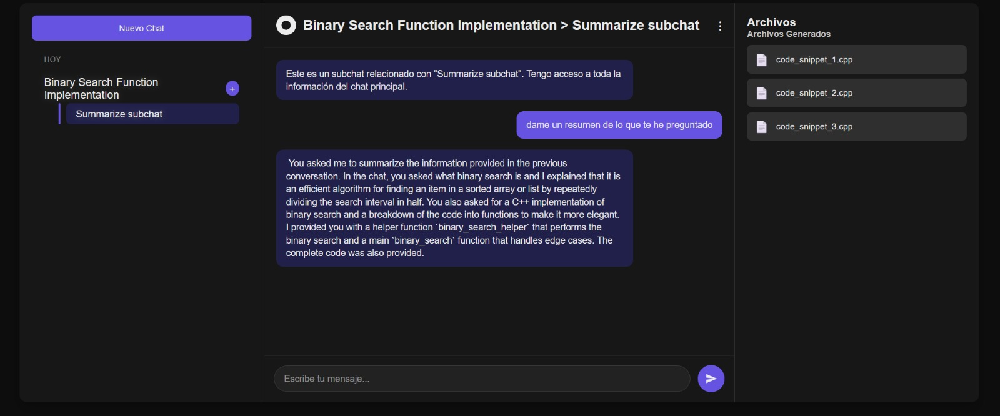
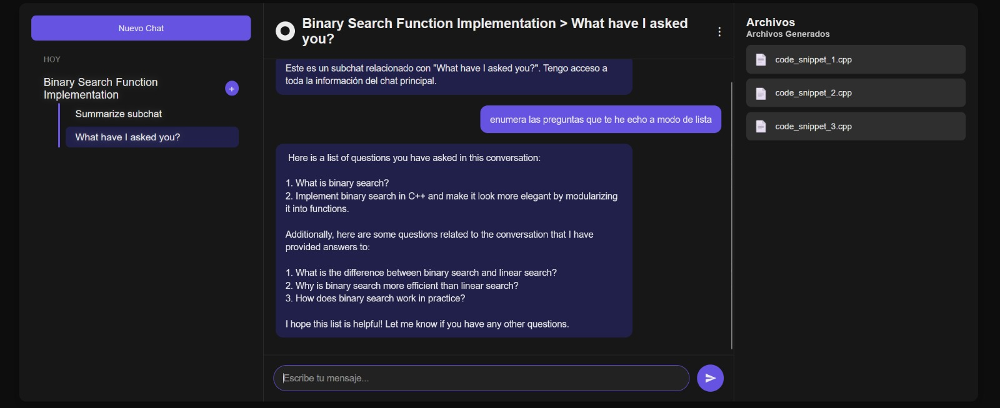

# Taskify.ai

A powerful chat-based application that helps you organize conversations with AI through intelligent subchats. This platform enables you to maintain order in your main discussions while allowing specialized subchats to inherit context from parent conversations.

## Features

- **Hierarchical Chat System**: Create subchats that inherit and learn from main conversations
- **Code Snippet Management**: Automatic detection and beautiful display of code blocks
- **File Management**: Track and access all generated and uploaded files in one place
- **Context Preservation**: Subchats maintain awareness of the parent conversation
- **Modern UI**: Clean, intuitive interface with dark mode support

## Screenshots

Here's a glimpse of Taskify.ai in action:








## Technologies Used

### Frontend
- React 18
- React Router DOM
- Context API for state management
- Prism.js for code highlighting
- CSS3 with custom theming

### Backend
- Node.js with Express
- Multiple AI model integration via Hugging Face API:
  - Mistral 7B
  - Phi-2
  - Qwen 1.8B Chat
- Local storage for session persistence
- RESTful API design

## How It Works

### Chat System
Taskify.ai uses a hierarchical chat structure where:
1. Main chats serve as primary conversation threads
2. Subchats can be created from any main chat to focus on specific subtopics
3. All subchats inherit context from their parent chat
4. Updates to the main chat automatically propagate to all subchats

### Context Sharing
When you send a message in a subchat:
- The system includes the relevant parent context when querying the AI
- Responses are specifically tailored to the subchat's focus while maintaining awareness of the main conversation
- This allows for specialized discussions without losing the broader context

### Code Management
- Code blocks are automatically detected in AI responses
- The system extracts code, identifies the language, and generates appropriate filenames
- A professional code viewer provides syntax highlighting, theme switching, and copy/download functionality
- All generated code is accessible through the file sidebar

## Installation

```bash
# Clone the repository
git clone https://github.com/yourusername/taskify-ai.git
cd taskify-ai

# Install dependencies
npm install

# Set up environment variables
cp .env.example .env
# Edit .env with your HuggingFace API key

# Start the development server
npm run dev
